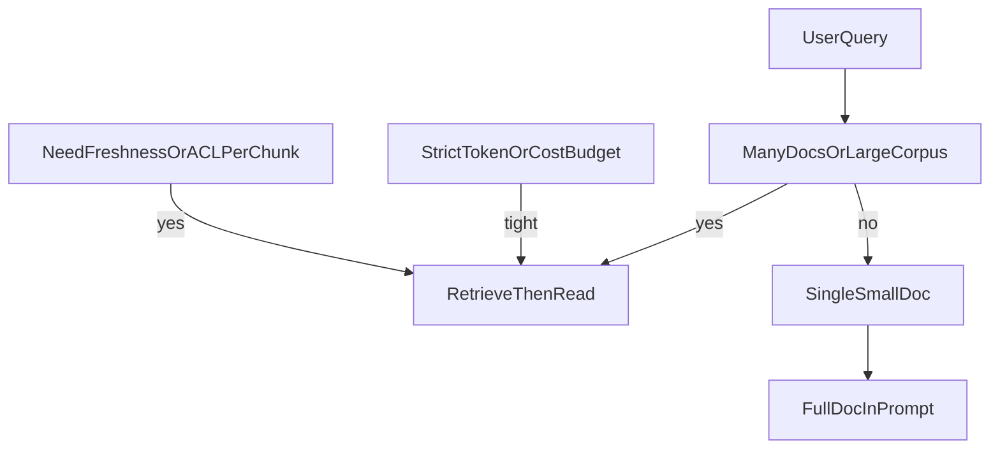

# Phase 1 — Foundations: step-by-step execution plan

This plan strictly follows Phase 1 in [docs/learning-plan.md](docs/learning-plan.md): **study** embeddings, similarity, ANN at a conceptual level, and RAG vs long context; **practice** a minimal notebook (chunk → embed → cosine top-k → prompt); **checkpoint** list **5+ failure modes** with examples.

---

## Outcomes (definition of done)

- One **Jupyter notebook** (or equivalent) in this repo that runs end-to-end: **chunk → embed → top-k by cosine → LLM answer** (LLM can be API or a tiny local model for cost control).
- A short **Phase 1 notes** section (Markdown in `docs/` or notebook markdown cells): **latency numbers** (embed batch, retrieval, generation if used) and a **failure-mode table** (minimum 5 rows, each with *what went wrong* and *which stage caused it*).

---

## Visual-learning pattern (use in every study block)

For each concept below, do **one** of: hand-drawn sketch, Excalidraw, or a **Mermaid diagram in the notebook** (the plan already uses Mermaid for the system; mirror that style for *local* concepts). The goal is an image you can recall, not perfect art.

Suggested recurring diagram types:

- **Vectors in 2D/3D** as stand-ins for high-D embedding space (cosine = angle, not Euclidean distance).
- **Before/after** panels: raw chunk vs retrieved chunk vs answer.
- **Pipeline swimlane**: Chunk | Embed | Index | Retrieve | Prompt.

---

## Step 0 — Environment and tiny corpus (half day)

- **Pick stack:** Python 3.11+, `jupyter` or VS Code notebooks, `numpy` for cosine, **one** embedding model ([sentence-transformers](https://www.sentence-transformers.org/) local **or** a single provider API—pick one and stay consistent for Phase 1).
- **Corpus:** 3–10 short documents you understand (your own notes, public Markdown, or copy-paste articles). Mix **synonyms**, **near-duplicates**, and **multi-topic** text so failures are visible later.
- **Deliverable:** `data/phase1/` (or similar) with raw `.md`/`.txt` files listed in the notebook.

---

## Step 1 — Embeddings (concept + micro-practice)

**Concept (visual):** Each chunk is a **point** in a high-dimensional space. Similar meaning → **near direction** (small angle). Unrelated → more orthogonal.

**Practice:**

- Embed **one sentence** and print vector shape (e.g. 384 or 768 dims). Plot **no** full dimensions; instead plot **two random projected dimensions** or a **single bar chart of a few dimensions** to internalize “it’s a long numeric fingerprint.”
- **Optional stretch:** Embed two paraphrases and two unrelated sentences; show cosine similarity numbers side by side.

**Checkpoint question:** “If I swap two words with synonyms, do the vectors move closer?” (verify empirically on 2–3 pairs.)

---

## Step 2 — Cosine similarity and top-k retrieval (concept + core practice)

**Concept (visual):** Draw **unit vectors** from the origin; cosine similarity = **cos(angle)**. Rank chunks by similarity to the **query vector**; take **top-k**.

**Practice (notebook cells, in order):**

1. **Chunk** with the simplest splitter first (fixed character or token window from Phase 2 preview is OK for Phase 1—keep it dumb on purpose).
2. **Embed** all chunks + query.
3. **Similarity:** `cosine_sim(q, c)` for each chunk (or normalized dot product).
4. **Top-k:** sort, take k=3–10.
5. **Inspect:** print top-k chunk text next to scores.

**Measure:** time **embedding all chunks** and time **brute-force similarity** (this is your baseline before any ANN).

---

## Step 3 — ANN indexes (HNSW / IVFFlat) — conceptual only

**Concept (visual):** Brute force = compare query to **every** chunk. **ANN** builds a **graph or clusters** so you visit only a **subset** of candidates—fast but **approximate** (recall < 100% possible).

**Practice (lightweight):**

- Draw **two diagrams**: (A) linear scan over all points; (B) “navigate neighborhood graph” sketch.
- **Optional code:** If you use **FAISS** or **pgvector** later, Phase 1 only needs a **comment** in the notebook: “ANN goes here; for Phase 1 we use exact search to isolate embedding quality.”

**Checkpoint question:** “Why might my ANN miss the best chunk even if embeddings are perfect?”

---

## Step 4 — When RAG helps vs long context / full-doc prompt (concept + decision rule)

**Concept (visual):** Decision flow (Mermaid-friendly):

**Practice:**

- For **each** of your 3–10 docs, run: (1) **full doc in prompt** vs (2) **top-k only** on the same question (pick questions that need **one paragraph** vs **whole doc**).
- Note **latency, cost, and answer quality** in a small table.

**Checkpoint:** Write **one paragraph** “when I’d still choose full-doc” vs “when retrieval is mandatory” using *your* corpus size and model limits.

---

## Step 5 — Minimal “RAG in one notebook” (integrate + prompt)

**Concept (visual):** Single pipeline diagram: **Query → TopK chunks → Prompt template → Answer**.

**Practice:**

- Build a **string prompt** with clear delimiters, e.g. `CONTEXT:` blocks with chunk ids.
- Generate an answer (API or local). **Do not** tune heavily—Phase 1 is about **observing** behavior.
- **Measure end-to-end latency** a few times (cold vs warm if using API).

---

## Step 6 — Qualitative failure hunt + checkpoint deliverable

The plan’s **checkpoint** is: **list 5 failure modes you observed**. Turn this into a **table** with columns: **Failure mode | Example query | What was retrieved | Why it’s wrong | Stage (chunk/embed/retrieve/gen)**.

**Minimum 5 categories to actively try to trigger** (aligns with the plan’s examples):

1. **Wrong chunk** — question maps to a different section than top-k.
2. **Synonym / vocabulary mismatch** — query words ≠ chunk words.
3. **Duplication** — overlapping chunks both rank high; redundant context.
4. **Lost nuance** — correct chunk retrieved but model **over-answers** or ignores context.
5. **Ambiguous query** — multiple valid answers in corpus; retrieval picks one arbitrarily.

**Visual learner tip:** For 2–3 rows, add a **screenshot or pasted snippet** showing retrieved chunks vs ideal chunk.

---

## Step 7 — Close Phase 1 (documentation + handoff to Phase 2)

- Add a **“Phase 1 complete”** subsection: what you learned, what you’d change in chunking next (foreshadows Phase 2 without implementing it).
- Ensure the [Phase checklist](docs/learning-plan.md) item **“Phase 1: Minimal dense RAG notebook; document failure modes”** is satisfied with links/paths in repo root `README` or [docs/README.md](docs/README.md) if present.

---

## Timeboxing (from the plan: 1–2 weeks part-time)

| Block     | Suggested time |
| --------- | -------------- |
| Steps 0–2 | 2–4 sessions   |
| Steps 3–4 | 1–2 sessions   |
| Steps 5–6 | 2–4 sessions   |
| Step 7    | 1 session      |

---

## Files to create (when you execute; not in plan mode)

- Notebook: e.g. `notebooks/phase1_dense_rag_baseline.ipynb`
- Corpus: e.g. `data/phase1/*.md`
- Notes: extend [docs/learning-plan.md](docs/learning-plan.md) or add `docs/phase1-notes.md` with failure-mode table and latency table

No new dependencies are mandated beyond your chosen embedding path; keep Phase 1 **minimal** so Phase 2–3 remain the main engineering depth.