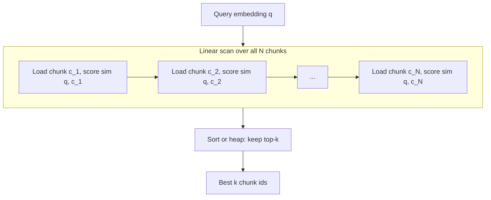
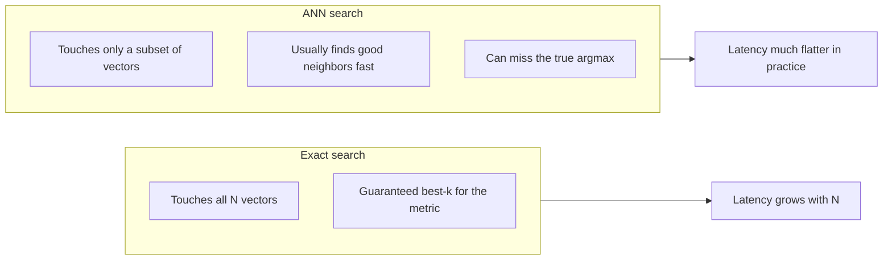
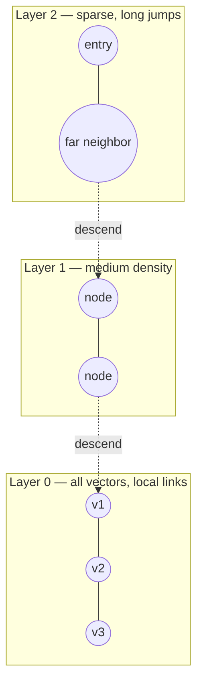
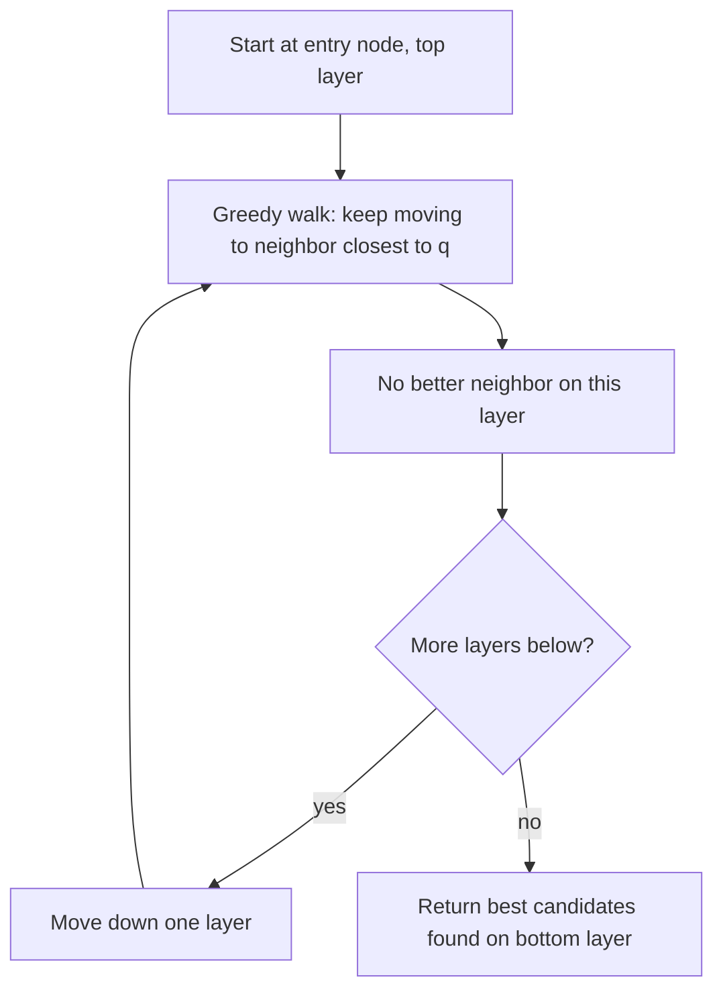

# Approximate nearest neighbors (ANN) and HNSW — elaborated

You store **many chunk embeddings** (thousands to billions). A **nearest-neighbor search** answers: *which stored vectors are closest to this query vector?* “Closest” is usually **cosine similarity** or **Euclidean distance** in the embedding space—they are related if vectors are **normalized** (unit length), which is common for semantic search.

This note contrasts **exact** search with **ANN** indexes (HNSW is one popular family) and uses **Mermaid** diagrams you can open in GitHub, VS Code, or many notebook renderers.

---

## 1. Exact search (brute force): compare everyone

**Idea:** There is no magic. For each chunk embedding `c_i`, score how similar it is to the query `q`, then sort and take **top-k**.

- **Pros:** You always see the *true* global best neighbors for your chosen metric (up to ties).
- **Cons:** Cost grows **linearly** with the number of chunks `N`: you touch every vector every query.

**When brute force is fine:** Phase 1 with tens or hundreds of chunks on a laptop—your notebook can do a NumPy dot-product matrix multiply and never think about ANN.

---

## 2. ANN: trade a little accuracy for a lot of speed

**Idea:** Precompute a **data structure** (an **index**) so that at query time you **do not** visit all `N` points. You follow **hints**—“likely neighbors”—and stop early.

- **Pros:** Query time often sublinear or much smaller constant factors; essential at huge scale.
- **Cons:** **Approximate:** the returned neighbors might **miss** the true best point if the index “navigated” wrong. Quality is measured by **recall** (e.g. *what fraction of the true top-10 did we actually return?*).

**Important:** Even if your **embedding model were perfect**, ANN could still return a slightly wrong set, because the **mistake is in the index traversal**, not in the vector arithmetic.

---

## 3. HNSW (Hierarchical Navigable Small World): intuition in layers

**HNSW** builds a **graph**: points are **nodes**, and **edges** connect “neighborhood” points so you can **greedily walk** from a start node toward the query.

To avoid getting stuck in local dead ends, HNSW uses **several layers**:

- **Upper layers:** **Fewer** nodes and **longer-range** links—think of them as a **highway** that quickly moves you to the right region of the space.
- **Lower layers:** **More** nodes and **shorter** links—**local roads** that refine the search.
- **Bottom layer:** Contains (typically) **all** vectors so nothing is “skipped” as a possible neighbor—but you still only **visit** a fraction of them thanks to the graph.

**Query sketch (conceptual):**

1. Enter at a **fixed entry point** on the **top** layer.
2. **Greedy walk:** repeatedly move to the neighbor **closest to the query** until you can’t improve.
3. **Drop down** one layer; repeat greedy walk.
4. Continue until the **bottom** layer, then return the best candidates you actually visited (often with a **beam** or **efSearch**-style parameter: how greedy vs. how thorough).

That’s why ANN can miss the global best: **greedy** steps on a **sparse graph** might never enter the “correct” basin of attraction, or might stop exploring too early.

---

## 4. Vocabulary: what people mean in tuning

| Term | Plain meaning |
|------|----------------|
| **Recall@k** | Of the *true* top-k neighbors, how many appear in *your* top-k (or in a candidate pool before reranking). |
| **efSearch** (HNSW) | Larger → explores more nodes → **higher recall**, **slower** queries. |
| **M** (HNSW) | Roughly, max neighbors per node in the graph; affects index build and connectivity. |
| **IVFFlat** (another ANN family) | **Cluster** vectors into “cells”; search only a **shortlist** of cells near the query. Also approximate. |

You don’t need to implement HNSW in Phase 1; understanding **exact vs. approximate** and **why recall < 100%** is enough before you plug in **FAISS**, **pgvector** HNSW, or **Qdrant** later.

---

## 5. One-line summary

**Brute force** = *check everyone, correct, slow*. **ANN (e.g. HNSW)** = *follow a pre-built graph/layers, fast, may skip the true winner—tune recall vs. latency.*
