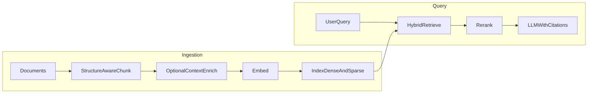

# Meridian Context — learning plan and roadmap

A phased learn-and-build path from RAG fundamentals to a **production-grade, community-usable** implementation. It aligns with 2025–2026 practice: hybrid retrieval, reranking, contextual chunking, structured evaluation, and optional agentic/graph extensions—while addressing known failure modes (chunking, retrieval–generation mismatch, eval gaps).

---

## What’s current (practice and research)

- **Architecture shift:** Static “embed → top-k → prompt” pipelines remain the baseline, but **agentic RAG** (iterative retrieval, tool use, planning/reflection) and **Graph RAG** (entities + relations, often **hybrid** with vectors) are where serious systems are heading. Surveys and SoK-style work emphasize **risks**: hallucination propagation, retrieval misalignment, and tool/agent failure modes—so production design needs **governance and evaluation**, not only clever retrieval.

- **Community pain points that still dominate:** (1) **chunking** (fixed token splits breaking semantics; structure-aware and contextual approaches win in practice), (2) **retrieval quality** (vocabulary mismatch → **hybrid** dense + sparse), (3) **precision** (**cross-encoder reranking** after recall-oriented retrieval), (4) **evaluation** treating retrieval and generation as one metric (**RAGAS**, **DeepEval**, golden sets, retrieval-specific metrics), (5) **“RAG didn’t fix hallucination”** when context is wrong or overloaded—mitigations: tighter top-k, compression, **citations/attribution**, abstention, and measuring **faithfulness** to retrieved context.

- **Technique worth building once:** **Contextual retrieval** (e.g. Anthropic’s line of work)—enrich each chunk with document/section context before embedding—to reduce “chunk out of context” retrieval failures; pair with **hybrid search** and reranking where budgets allow.

**Reading list (not prerequisites):**

- [Anthropic: Contextual Retrieval](https://www.anthropic.com/research/contextual-retrieval)
- [Agentic RAG survey (arXiv)](https://arxiv.org/abs/2603.07379)
- [RAGAS docs](https://docs.ragas.io/)
- [DeepEval RAG tutorials](https://deepeval.com/tutorials/rag-qa-agent/improvement)

---

## Learning outcomes

By the end you should be able to:

1. Design ingestion with **structure-aware chunking**, metadata, and optional **contextual enrichment** before embedding.
2. Implement **hybrid retrieval** (dense + BM25-like sparse), **reranking**, and sensible **top-k / budget** policies.
3. Run a repeatable **eval loop** (retrieval metrics + end-to-end QA + faithfulness/citation checks).
4. Ship an API/service with **observability**, **security basics** (auth, rate limits, injection-aware prompting), and **operational** concerns (reindex, versioning, cost).
5. Package something **others can clone and run** (Docker Compose, env templates, docs, minimal UI or CLI).

---

## Target system (what Meridian Context becomes)

**Scope:** An open-source retrieval stack (not a hosted SaaS requirement) with:

- **Ingestion CLI/API:** upload docs (PDF, Markdown, HTML); structure-aware split; optional contextual chunk enrichment; embed and index.
- **Query API:** hybrid search → rerank → LLM answer with **inline citations** (chunk ids / source spans).
- **Eval harness:** small golden dataset + scripts for RAGAS/DeepEval (or pluggable); CI job that runs on a tiny fixture corpus.
- **Default stack suggestion:** **Python + FastAPI**, **PostgreSQL + pgvector** (or **Qdrant**), **sentence-transformers** or provider embeddings, **rank-bm25** or DB-native FTS for sparse side, **cross-encoder** reranker (e.g. small MS MARCO–style model) where latency allows.
- **Docs:** architecture diagram, tuning guide (chunk size, overlap, top-k, rerank depth), and “when to add agentic/graph layers.”

This directly targets issues practitioners hit often: bad chunking, no hybrid, no rerank, no eval, and answers without provenance.

---

## Phased learn-and-practice plan

### Phase 1 — Foundations (1–2 weeks)

- **Study:** Embeddings, cosine similarity, ANN indexes (HNSW/IVFFlat at a conceptual level), when RAG helps vs long context / full-doc prompt.
- **Practice:** Minimal notebook: chunk text → embed with one model → cosine top-k → prompt; measure latency and qualitative failures.
- **Checkpoint:** List 5 failure modes you observed (wrong chunk, synonym mismatch, duplicated chunks, etc.).

### Phase 2 — Chunking and metadata (1–2 weeks)

- **Study:** Paragraph/heading-aware splitting, overlap tradeoffs, parent-child chunk patterns, metadata filters (source, date, section).
- **Practice:** Implement two chunkers (fixed-size vs structure-aware) on the **same corpus**; compare retrieval hit-rate on a hand-built query set (20–50 questions).
- **Checkpoint:** Document which corpus types need which strategy (Markdown vs PDF vs tickets).

### Phase 3 — Hybrid retrieval and reranking (2 weeks)

- **Study:** Why BM25/FTS complements embeddings; two-stage retrieve-wide / rerank-narrow; latency vs quality.
- **Practice:** Add sparse retrieval + fusion (e.g. RRF or weighted); add cross-encoder reranking on top 50 → top 5.
- **Checkpoint:** A/B table: hybrid vs dense-only vs hybrid+rerank on your golden questions.

### Phase 4 — Contextual chunks and generation discipline (1–2 weeks)

- **Study:** Contextual retrieval idea; citation-grounded prompting; abstention when evidence is weak.
- **Practice:** Optional enrichment step: for each chunk, prepend short document/section summary (cached batched LLM calls); embed enriched text; compare retrieval metrics.
- **Checkpoint:** Answers must include **citations**; add a simple “insufficient context” path.

### Phase 5 — Evaluation as a system (2 weeks)

- **Study:** Context precision/recall, answer faithfulness, RAGAS/DeepEval concepts; avoid “vibe-only” eval.
- **Practice:** Curate 50–200 QAs from your corpus; automate weekly eval script; track metrics in a JSON report or MLflow-style run log.
- **Checkpoint:** Regression: changing chunk size must show up in metrics.

### Phase 6 — Production hardening (2–3 weeks)

- **Study:** Idempotent ingestion, incremental reindex, secrets, PII redaction basics, rate limiting, observability (traces, retrieval logs), cost controls (cache prompts, batch embed).
- **Practice:** Docker Compose for API + DB; structured logging; health checks; `/v1/query` and `/v1/ingest` with API keys; document SLAs you’re targeting.
- **Checkpoint:** Another developer can `git clone`, `cp .env.example .env`, `docker compose up`, ingest sample docs, and query with citations.

### Phase 7 — Community stretch (optional, 2+ weeks)

Pick **one** extension aligned with trends (avoid doing all at once):

- **Agentic RAG:** single agent with retrieve + read_chunk tools and a max-step budget; eval for tool misuse and cost.
- **Light Graph RAG:** entity extraction on a small domain; optional hybrid with vector search for onboarding path.
- **Multimodal:** image captions or vision embeddings for slide decks—only if you have a clear user story.

---

## Phase checklist

Use this to track progress in issues or project boards.

- [ ] **Phase 1:** Minimal dense RAG notebook; document failure modes
- [ ] **Phase 2:** Structure-aware vs fixed chunking + metadata; small query set
- [ ] **Phase 3:** Hybrid retrieval + cross-encoder rerank; compare metrics
- [ ] **Phase 4:** Optional contextual enrichment + citation-grounded answers
- [ ] **Phase 5:** Golden dataset + RAGAS/DeepEval automation + regression discipline
- [ ] **Phase 6:** FastAPI service, Docker Compose, auth/rate limits, observability, docs
- [ ] **Phase 7 (optional):** Agentic tool-RAG **or** light Graph RAG **or** multimodal slice

---

## What “done” looks like for the community artifact

- Public repo with **README**, **architecture**, **quickstart**, **configuration reference**, and **evaluation** instructions.
- **License** (MIT) and **CONTRIBUTING** with how to add chunkers or retrievers.
- **Demo corpus** and **fixture tests** so CI proves the pipeline works without private data.
- **Explicit non-goals** (e.g. “not a full enterprise KMS”) to keep scope honest.

---

## Suggested time budget

- **Core path (Phases 1–6):** roughly **10–14 weeks** at part-time depth; faster if full-time.
- **Stretch (Phase 7):** add **2+ weeks** per major extension.

---

## Repository home

This repository is the **dedicated project** for executing the plan: keep implementation, eval fixtures, and docs versioned here so contributions and CI stay coherent.
