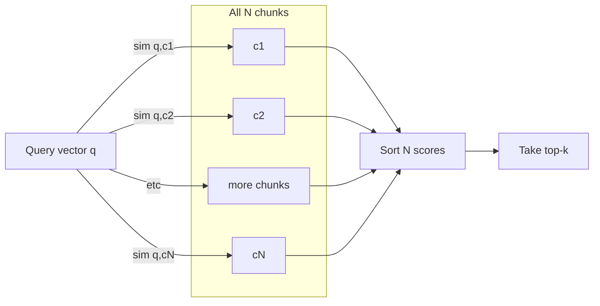
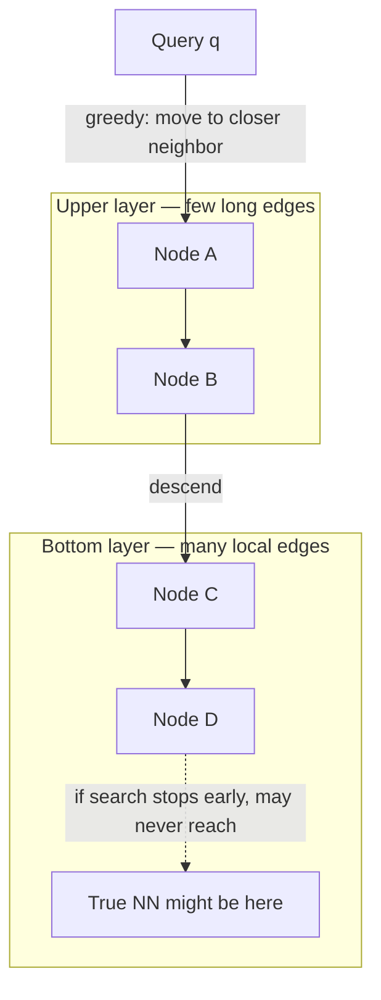

# Phase 1 — Step 3: Approximate nearest neighbors (theory)

Step 3 of the Phase 1 foundations track ([learning-plan.md](./learning-plan.md), Phase 1) is **conceptual only**. You already implemented **exact** retrieval in the notebook (brute-force cosine / dot over all chunks). This document is the visual and verbal anchor for **why** production systems switch to **ANN** indexes, what **HNSW** and **IVFFlat** mean at a high level, and how approximation can miss the true best neighbor **even when embeddings are perfect**.

---

## 1. Exact search vs approximate search

| | **Exact (brute force)** | **Approximate (ANN)** |
|--|-------------------------|------------------------|
| **Idea** | Score the query against **every** stored vector; sort; take top-k. | Precompute a **structure** (graph, clusters, trees, …) so the query visits only a **subset** of candidates. |
| **Recall** | True top-k in the full set (for that similarity definition). | Often **below 100%** — the global best neighbor may never be examined. |
| **Query cost** | \(O(N \cdot d)\) for \(N\) vectors of dimension \(d\) with a flat scan (or one big matmul). | Typically **sublinear** in \(N\) in practice, or much better constants, at the cost of approximation. |
| **When it wins** | Small \(N\), debugging, baselines, or when you must guarantee ranking. | Large \(N\), strict latency SLOs, online serving. |

**Takeaway:** ANN is an **algorithmic** shortcut. It does not fix bad embeddings or bad chunks; it only makes search faster when you accept that you might not see every candidate.

---

## 2. Diagram (A) — Linear scan / brute force (exact)

Every chunk embedding is scored against the query; all scores are sorted.

This matches your Step 2 notebook path: one matrix–vector product over all rows, then `argsort`.

---

## 3. Diagram (B) — ANN via a neighborhood graph (HNSW sketch)

**HNSW** (Hierarchical Navigable Small World) is a widely used **graph-based** ANN index. Vectors are **nodes**; **edges** connect “neighbors” in embedding space. The graph is built in **layers**: upper layers are **sparse** (long jumps), the bottom layer is **dense** (local connectivity).

At **query time**, the search **enters** the graph (often from a fixed entry point), moves **greedily** toward nodes closer to the query, optionally **descends** through layers, and **stops** after a **budget** of expansions (e.g. **efSearch** in many implementations). It never compares the query to all \(N\) nodes.

**Intuition:** You are **hiking** a trail network toward lower “altitude” (distance to the query). If the trail system has no bridge to the valley where the true minimum lies, you will never find it — even if your altitude meter (embedding geometry) is perfect.

---

## 4. IVFFlat — clusters and inverted lists (second common pattern)

**IVF** = **Inverted File**. Vectors are **partitioned** into **clusters** (centroids), often with k-means at **index build** time. Each cluster holds an **inverted list** of vector ids (or the vectors themselves).

At **query** time:

1. Compare the query to **centroids** and pick the **nearest** one(s).
2. Run exact (or further approximate) search **only inside** those lists (**nprobe** clusters).

**Pros:** Simple mental model; good speed when the query lands in the **right** cluster.

**Failure mode:** The **true** nearest neighbor may sit in a **different** cluster from the one you probe. If **nprobe** is small, you never score that vector.

**“Flat”** in IVFFlat usually means: inside each list, distance is **exact** (brute force over that subset). Variants can nest other indexes inside clusters.

---

## 5. Vocabulary cheat sheet

| Term | Meaning |
|------|---------|
| **ANN** | Approximate nearest neighbor — any method that skips a full scan. |
| **Recall@k** | Fraction of the **true** top-k neighbors (under exact distance) that appear in **your** returned top-k (or in a larger candidate pool before reranking). |
| **HNSW `M`** | Roughly, **max neighbors per node** in the graph (build-time connectivity; higher → denser graph, more memory, often better recall). |
| **HNSW `efConstruction`** | Build-time search width — how hard the index tries when linking neighbors (higher → better graph quality, slower build). |
| **HNSW `efSearch`** | Query-time **frontier size** — larger → explores more nodes → **higher recall**, **slower** queries. |
| **IVF `nlist`** | Number of clusters (coarser → fewer centroids, each list larger). |
| **IVF `nprobe`** | How many clusters to search at query time (higher → better recall, slower). |

Exact names vary slightly between **FAISS**, **pgvector**, **Milvus**, etc., but the **roles** are the same.

---

## 6. Checkpoint answer: *Why might my ANN miss the best chunk even if embeddings are perfect?*

**“Perfect embeddings”** here means: the **distance or cosine** in \(\mathbb{R}^d\) faithfully reflects which chunks you care about. That is a property of the **vector space**, not of the **search algorithm**.

ANN **deliberately does not** evaluate every vector. So the global argmax can be missed because:

1. **Graph methods (HNSW):** Search is **greedy** on a **sparse** graph. The shortest path in the graph from the entry point to the true nearest neighbor might require an edge that **does not exist** or is **never traversed** within **efSearch**. You stop in a **local** basin.
2. **IVF methods:** The true best chunk may belong to a cluster you **did not probe** (too few probes, or centroid assignment error).
3. **Any approximate index:** You traded **exhaustiveness** for **speed**. **Guaranteed** exact top-k requires **falling back** to a full scan (your Step 2 baseline) or raising ANN parameters until behavior is near-exhaustive (often defeating the purpose).

So: **embedding quality** and **index approximation** are **orthogonal failure modes**. Phase 1 keeps **exact** search so you can debug the former without confounding the latter.

---

## 7. Where this lands in later work

When \(N\) or latency forces ANN, typical stacks include:

- **FAISS** — `IndexHNSWFlat`, `IndexIVFFlat`, and many variants (GPU, compression, …).
- **pgvector** (Postgres) — HNSW / IVFFlat–style indexes over a table of embeddings.
- Managed vector DBs — same ideas under different parameter names.

The notebook keeps a **comment-only hook** after Step 2: *ANN goes here; Phase 1 uses exact search to isolate embedding quality.*

---

## 8. Hand off to Step 4

Next in the plan: **when RAG (retrieve then read) helps vs putting a full document in the prompt** — decision rules, same-question comparisons, and a small table (latency, cost, quality). That belongs in the notebook and/or Phase 1 notes, not in this ANN theory page.

---

## References (optional reading)

- Malkov, Yashunin — *Efficient and robust approximate nearest neighbor search using Hierarchical Navigable Small World graphs* (HNSW).
- FAISS documentation — index factory strings and parameter guides.
- pgvector — index types and tuning notes for HNSW / IVF.
